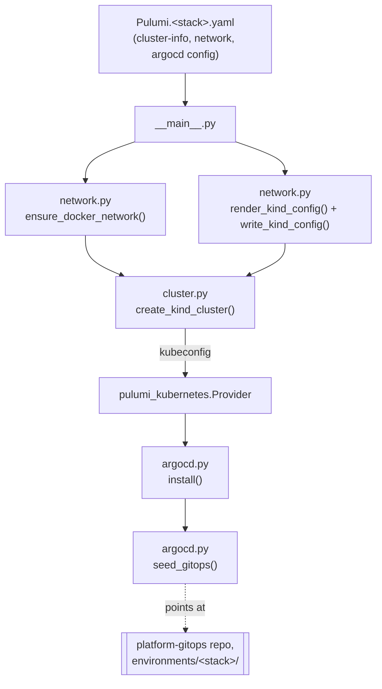

# Learning: platform-core

A teaching companion for this repo — the *why* behind the code, not just the
what, written for a technical PM learning platform engineering hands-on. See
[`platform-team-administration/LEARNING.md`](../platform-team-administration/LEARNING.md)
first if you haven't read it: this repo builds *inside* the empty, protected
containers that one creates.

> **How to use this:** the boxes marked "Predict before reading on" are
> collapsed — try to answer before opening them. Every `$` command is real,
> run against this project's actual live infrastructure, not a mockup.

---

## 1. From an empty box to something running

`platform-team-administration` gets you a named, protected GitHub repo. That
repo is still empty air — no server runs, nothing responds to a request.
`platform-core`'s entire job is filling that air with something real: three
independent local Kubernetes clusters (`platform-sandbox`, `app-dev`,
`app-prod`), each with its own network, and — as of the most recent work — a
GitOps controller (Argo CD) running inside each one.

"Three independent clusters" is worth pausing on. This is not three
namespaces inside one shared cluster — it's three *entirely separate*
Kubernetes control planes, each running as its own set of Docker containers
on your machine, using [Kind](https://kind.sigs.k8s.io/) (**K**ubernetes
**in** **D**ocker). Nothing in `app-dev` can accidentally see or affect
`app-prod`, because they aren't different corners of the same building —
they're different buildings. That isolation is the entire point of having
separate stacks instead of one big cluster split by label.

Each of the three stacks runs the exact same `__main__.py`, with different
config values (`Pulumi.platform-sandbox.yaml`, `Pulumi.app-dev.yaml`,
`Pulumi.app-prod.yaml`). One blueprint, three houses.



Everything left of the dotted line is this repo's job. Everything right of
it — what actually gets deployed — becomes `platform-gitops`'s and
`platform-services`'s job, the moment `seed_gitops()` runs. That handoff
point is worth remembering; it's where this repo's responsibility ends.

---

## 2. Networking: one real address, two made-up ones

[`modules/network.py`](modules/network.py) creates two very different kinds
of "network" for each cluster, and confusing them is an easy mistake:

- **`vpcCidr`** — a *real* address range on your actual machine's Docker
  network (`10.0.0.0/16` for sandbox, `10.1.0.0/16` for app-dev,
  `10.2.0.0/16` for app-prod). These have to be different per environment,
  the same way three houses on one street need three different addresses.
- **`podCidr` / `serviceCidr`** — addresses Kubernetes invents purely for its
  own internal bookkeeping (pod-to-pod and service traffic *inside* one
  cluster). Nothing outside that one cluster ever sees or routes to them, so
  every environment reuses the identical values
  (`10.244.0.0/16` / `10.96.0.0/12`) with zero conflict — like every house on
  the street numbering its own internal rooms "Room 1, Room 2" without any
  collision, because nobody outside the house cares about room numbers.

`ensure_docker_network()` is the literal equivalent of typing
`docker network create <name> --subnet <cidr>` yourself:

```python
return local.Command(
    "docker:net",
    create=f"docker network create {cfg.dockerNetwork} --subnet {cfg.vpcCidr} || true",
    delete=f"docker network rm {cfg.dockerNetwork} || true",
)
```

That `|| true` exists so re-running this doesn't fail just because the
network is already there — a normal idempotency trick. But it has a sharp
edge worth seeing for yourself before I explain it.

<details>
<summary><strong>Predict before reading on:</strong> <code>Pulumi.platform-sandbox.yaml</code> declares <code>vpcCidr: 10.0.0.0/16</code>. If <code>platform-sandbox-net</code> already existed under a <em>different</em> subnet the first time this command ever ran — say, created earlier with Docker's own default addressing — what does <code>|| true</code> do to that mismatch on every run since?</summary>

Run this yourself right now, on this project's real, live Docker networks:

```console
$ docker network inspect app-dev-net --format '{{json .IPAM.Config}}'
[{"Subnet":"10.1.0.0/16","Gateway":"10.1.0.1"}]

$ docker network inspect platform-sandbox-net --format '{{json .IPAM.Config}}'
[{"Subnet":"fc00:19bf:c38:776c::/64","Gateway":"fc00:19bf:c38:776c::1"},{"Subnet":"172.18.0.0/16","Gateway":"172.18.0.1"}]
```

`app-dev-net` matches its config exactly: `10.1.0.0/16`. But
`platform-sandbox-net` — right now, in this real project, as you read this —
is running on `172.18.0.0/16`, Kind's own default Docker subnet, **not**
the `10.0.0.0/16` declared in `Pulumi.platform-sandbox.yaml`.

Here's why `|| true` allows this to happen invisibly: `docker network
create` fails with a nonzero exit code if a network with that name already
exists — it does **not** silently update an existing network to match new
flags you pass it. `|| true` swallows that failure so Pulumi doesn't treat
"already exists" as an error. But it swallows *every* failure that way,
including "exists, with the wrong subnet." Since `platform-sandbox`'s Kind
cluster was almost certainly the very first one ever created in this whole
project — before `vpcCidr` was even a config value that mattered — the
network got created once, under Docker's default addressing, and every
`pulumi up` since has quietly no-op'd past the mismatch rather than fixing
it.

**This is still true right now, unfixed, in this repo.** It doesn't break
anything — pods still get valid addresses, nothing routes incorrectly — but
`pulumi preview` will never show it as drift, and reading the config file
alone would tell you the wrong subnet. The lesson generalizes past Docker:
**an idempotent "create if not exists" is not the same guarantee as "make
reality match this config" — the difference is invisible until you check
by hand, the way you just did.**
</details>

`render_kind_config()` and `write_kind_config()` handle the second half of
networking setup: producing the YAML file Kind itself reads to know which
pod/service ranges to use, and writing it to
`.pulumi/kind/<cluster-name>.yaml`:

```console
$ cat .pulumi/kind/pe-sandbox.yaml
kind: Cluster
apiVersion: kind.x-k8s.io/v1alpha4
networking:
  podSubnet: 10.244.0.0/16
  serviceSubnet: 10.96.0.0/12
nodes:
- role: control-plane
- role: worker
```

One implementation detail worth knowing about, not because you'll ever hit
it, but because it's a real class of bug: the book's original version of
`write_kind_config()` built this file by inlining the YAML text directly
into a shell command. YAML is full of exactly the characters that break
shell parsing — colons, quotes, dashes — so a config value containing any of
those could silently corrupt the file it wrote, or break the command
outright. The fix here base64-encodes the YAML before it ever touches a
shell command, then decodes it back to a file on the other side:

```python
b64 = base64.b64encode(yaml_content.encode("utf-8")).decode("ascii")
script = f"mkdir -p .pulumi/kind && echo {b64} | base64 -d > {path}"
```

Base64 output is guaranteed to be plain letters, digits, `+`, `/`, and `=` —
nothing a shell could ever misinterpret. This is a genuinely common pattern
any time you're handing structured text to a shell command: encode first,
decode on the other side, and the shell never gets a chance to "helpfully"
reinterpret your content.

---

## 3. The cluster itself: Pulumi's escape hatch

Kind isn't a cloud provider, so Pulumi has no built-in "Kind cluster"
resource type the way it has a built-in "AWS EC2 instance" type.
[`modules/cluster.py`](modules/cluster.py) uses Pulumi's actual escape hatch
for exactly this situation — `pulumi_command.local.Command`, which lets
Pulumi manage an arbitrary shell command as if it were a real resource, with
real create/delete lifecycle:

```python
create = local.Command(
    "kind:create",
    create=create_cmd,                              # kind create cluster ...
    delete=f"kind delete cluster --name {cfg.name}", # runs on `pulumi destroy`
    triggers=replace_triggers or [],
    opts=create_opts,
)
```

`triggers` is what makes this safe to re-run: Pulumi has no native way to
detect "did the Kind config or Docker network actually change" for an
arbitrary shell command the way it would for a typed cloud resource, so
`triggers` tells it explicitly — re-run `create` if any of these values
(the rendered Kind YAML, the Docker network name, the node image) differ
from last time. Without this, Pulumi would consider the cluster "already
created" forever, even after a config change that should have replaced it.

Once the cluster exists, a second `local.Command` fetches its kubeconfig —
the credentials `kubectl` and Pulumi both need to talk to it — and a
`pulumi_kubernetes.Provider` is built from that kubeconfig, becoming the
one, single connection every later Kubernetes resource in this program (the
Argo CD install, the bootstrap Application) goes through.

<details>
<summary><strong>Predict before reading on:</strong> This project runs 3 Kind clusters simultaneously on one machine, each on its own Docker network via <code>KIND_EXPERIMENTAL_DOCKER_NETWORK</code>. What goes wrong if you try to <em>create</em> a new one while another is still mid-bootstrap?</summary>

This happened for real while building `app-prod`: creating a new Kind
cluster while another cluster (also using
`KIND_EXPERIMENTAL_DOCKER_NETWORK`) was still finishing its own bootstrap
caused the new cluster's `kubeadm join` step to fail outright — worker nodes
couldn't find their control plane, with errors like `nodes "X-worker" not
found`. Kind's use of that experimental flag isn't fully safe for
concurrent multi-cluster bootstraps; the tooling briefly steps on itself.

The workaround, confirmed by testing it directly: **pause the other
clusters' containers while a new one is being created**, then unpause them
once it's done:

```console
$ docker pause app-dev-control-plane app-dev-worker app-prod-control-plane app-prod-worker
$ pulumi up --yes   # creates platform-sandbox cleanly, uncontended
$ docker unpause app-dev-control-plane app-dev-worker app-prod-control-plane app-prod-worker
```

This is a real, still-open limitation of running multiple Kind clusters
this way on one machine — not something this codebase can fully paper over,
just something to know before you next run `pulumi up` on a stack whose
cluster doesn't exist yet while the others are running.
</details>

A second, smaller real incident: after a cluster got stuck mid-boot from a
`docker stop`/`docker start` cycle, it was recreated manually with `kind
delete cluster` + `kind create cluster` — bypassing Pulumi entirely. That
left Pulumi's *stored* kubeconfig pointing at stale certificates for a
cluster that no longer existed under those certs. The fix is a genuinely
useful Pulumi technique worth knowing:

```console
$ pulumi up --yes --target-replace 'urn:pulumi:...:kind:kubeconfig' --target-dependents
```

`--target-replace` forces one specific resource to be destroyed and
recreated (refetch the kubeconfig, this time for real); `--target-dependents`
tells Pulumi to also refresh everything that depends on it — in this case,
the Kubernetes provider built from that kubeconfig. Without
`--target-dependents`, you'd get a fresh kubeconfig sitting next to a
provider still built from the old, wrong one.

---

## 4. Argo CD: where Pulumi's job stops

[`modules/argocd.py`](modules/argocd.py) is the last thing this repo does,
and it's a deliberate boundary, not an afterthought. Its docstring states the
rule plainly:

> Pulumi's job stops at getting the controller running. Once Argo CD is up,
> it takes over watching Git and reconciling application manifests on its
> own loop — Pulumi should never again touch a resource Argo CD owns.

This is the **IaC vs. configuration-code** boundary from the book, drawn as
actual code: `install()` runs a Helm chart once, to get Argo CD itself
running. `seed_gitops()` creates exactly one object — an Argo `Application`
— that tells Argo CD to start watching `platform-gitops`. After that single
object exists, this repo's involvement in what runs on the cluster is over;
every deployment from here forward is Argo CD discovering the next
`Application` on its own, not another `pulumi up`.

```python
argocd_root_app = argocd.seed_gitops(
    k8s,
    repo_url="https://github.com/phrankson/platform-gitops.git",
    path=f"environments/{pulumi.get_stack()}",
    depends_on=[argocd_release],
)
```

Notice `pulumi.get_stack()`, not `cls_cfg.name` — worth knowing this
distinction cold. `platform-gitops`'s folders are named after the *Pulumi
stack* (`platform-sandbox`, `app-dev`, `app-prod`); the Kind *cluster* names
are different (`pe-sandbox`, `app-dev`, `app-prod` — sandbox's cluster name
doesn't match its stack name). Using the wrong one here would point Argo CD
at a folder that doesn't exist.

The book's version of this section uses Flux, not Argo CD — a choice this
project made deliberately. The translation is a real simplification, not
just a rename: Flux needs two separate CRDs (`GitRepository` for "which
repo," `Kustomization` for "which path, how to reconcile it"). Argo CD's
single `Application` object folds both into one resource, because Argo
inlines the repo URL directly into the object that also says where to
deploy it — there's no separate "repository registration" step to manage.

<details>
<summary><strong>Predict before reading on:</strong> the first real <code>pulumi up</code> that installed Argo CD onto this cluster failed with the Helm release stuck in a "failed pre-install" state, and a pod called <code>redis-secret-init</code> in <code>CrashLoopBackOff</code> logging <code>dial tcp 10.96.0.1:443: i/o timeout</code> — a total failure to reach the Kubernetes API from *inside* the cluster. Argo CD's Helm chart wasn't misconfigured. What single host-level setting, shared across all three Kind clusters at once, was the actual cause?</summary>

The real culprit was `kube-proxy` — the component that programs the network
rules making a cluster's internal API address (`10.96.0.1`) actually
resolve to anything — crash-looping on **every node of all three Kind
clusters simultaneously**, with the telling error `"command failed"
err="failed complete: too many open files"`.

The root cause was one Linux kernel limit, shared by every process on the
machine regardless of which container it's in:

```console
$ sysctl fs.inotify.max_user_instances
fs.inotify.max_user_instances = 128
```

`128` is comfortably enough for *one* Kind cluster. Running three
simultaneously — each with its own kube-proxy, kubelet, and CoreDNS all
needing their own inotify watches to detect config changes — exhausted that
shared budget. Once kube-proxy couldn't start, nothing inside any of the
three clusters could reach the Kubernetes API at all: not Argo CD's
install hook, not CoreDNS, nothing. The visible symptom (Argo CD failing to
install) was several layers downstream of the actual cause (a host resource
limit with zero connection to Argo CD, Helm, or this codebase).

The fix is a host-level, one-time `sudo` change — not a code change:

```console
$ sudo sysctl fs.inotify.max_user_watches=524288
$ sudo sysctl fs.inotify.max_user_instances=512
```

After that, `kube-proxy` recovered on its own within the next restart cycle
(forced immediately with `kubectl delete pod` rather than waiting out the
backoff timer), and the exact same `pulumi up` that had just failed
succeeded cleanly on retry with zero code changes.

This is worth sitting with as a category of bug, not just a one-off fix:
**the deepest layer of a stack (the host kernel) can produce a symptom that
looks exactly like a misconfiguration three layers up (a Helm chart), and
the only way to tell the difference is checking the layer the error message
doesn't mention at all.**
</details>

**Try it yourself** — the whole App-of-Apps chain, live, right now:

```console
$ kubectl get applications -n argocd
NAME                SYNC STATUS   HEALTH STATUS
platform-gitops     Synced        Healthy
platform-services   Synced        Healthy
istio-base          OutOfSync     Healthy
istiod              OutOfSync     Healthy
istio-ingress       Synced        Progressing
```

`platform-gitops` is the object `seed_gitops()` created. Everything below it
in that list, this repo never created directly — Argo CD found those on its
own, by reading `platform-gitops`. See
[`platform-gitops/LEARNING.md`](../platform-gitops/LEARNING.md) for what
those actually are.

---

## 5. Verification, and a few smaller book corrections

[`tests/integration/infrastructure.bats`](tests/integration/infrastructure.bats)
exists for a specific reason: `pulumi up` reporting success only means
Pulumi's own resources reconciled without error — it says nothing about
whether the *result* actually works. This test fetches the stack's real
kubeconfig and independently checks that the Docker network exists and
`kubectl get nodes` returns at least one node — proof from a completely
different tool, not Pulumi grading its own homework.

```console
$ export PULUMI_STACK=platform-sandbox
$ bats tests/integration/infrastructure.bats
 ✓ docker network exists
 ✓ kubernetes cluster is accessible
```

A short list of smaller, lower-stakes corrections to the book's text, worth
knowing about but not deep enough to earn a full reflection prompt:

- **`pulumi stack init <name>` does not create `Pulumi.<name>.yaml`** —
  contrary to what the book implies. The file only appears after the first
  `pulumi config set` or `pulumi preview`/`up` against that stack.
- **`mypy` hangs indefinitely** on this codebase without
  `--follow-imports=skip` — it chases into `pulumi_kubernetes`'s enormous
  generated SDK otherwise. See the `lint-code` command in
  [`.circleci/config.yml`](.circleci/config.yml).
- **`isort` and `black` disagree by default** on blank lines around
  individually-commented imports. Fixed once, project-wide, with
  [`.isort.cfg`](.isort.cfg)'s `profile = black` — a one-line fix for a class
  of formatter fight you'll hit in most Python projects using both tools.

---

## 6. CI/CD: the same push-vs-tag idea, now across three environments

[`.circleci/config.yml`](.circleci/config.yml) extends the pattern from
`platform-team-administration` — push previews, tags deploy — across three
environments with two approval gates instead of one, because promoting
through `app-dev` before `app-prod` is the whole point of having three
environments rather than one:


Every deploy step is followed immediately by its own independent validation
step before the next approval gate even becomes available — a stack is
never "promoted" on Pulumi's say-so alone.

---

## Where this leads next

This repo's last act, for each stack, is creating one Argo `Application`
pointing at `platform-gitops`. Everything that determines what actually runs
inside these clusters from here on lives in that repo instead. See
[`platform-gitops/LEARNING.md`](../platform-gitops/LEARNING.md) for the
App-of-Apps structure Argo CD found when it went looking.
