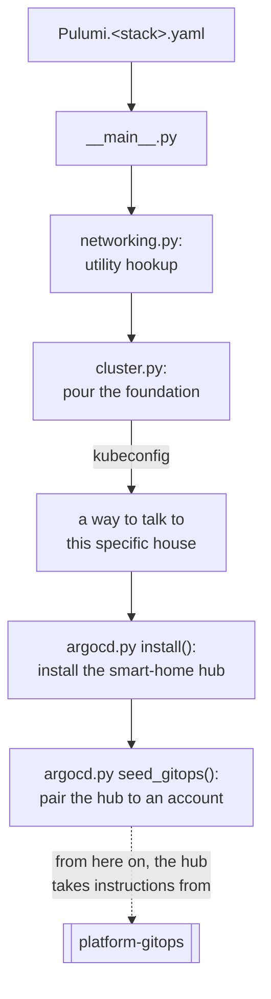

# Learning: platform-core

A teaching companion for this repo, continuing directly from
[`platform-team-administration`'s learning companion](../../platform-team-administration/learning/README.md).
That repo's Department of Buildings and Planning issues permits for empty
parcels. This repo is the construction crew that shows up on one of those
parcels and actually builds something.

1. **[Networking](networking.md)** — the utility hookup: real vs. made-up
   addresses, and a mismatch still live on this project right now.
2. **[Cluster Provisioning](cluster-provisioning.md)** — pouring the
   foundation with no prefab kit available, and a real conflict between two
   crews sharing one power supply.
3. **[Argo CD and the Handoff](argocd-and-handoff.md)** — installing a
   smart-home hub and stepping back, plus the incident that took down all
   three houses' power at once.
4. **[Verification and CI/CD](verification-and-cicd.md)** — proving the
   house is actually livable, not just reported finished.

> **How to use this:** boxes marked "Predict before reading on" are
> collapsed — try to answer before opening them. Every `$` command is real,
> run against this project's actual live infrastructure.

---

## Three houses, not three rooms

`platform-team-administration` created three permits worth of nothing —
`platform-sandbox`, `app-dev`, `app-prod` exist only as protected, empty
GitHub repos. This repo is where each of those becomes an actual,
independent local Kubernetes cluster, built with
[Kind](https://kind.sigs.k8s.io/) (**K**ubernetes **in** **D**ocker).

The word *independent* is worth being precise about, because it's tempting
to picture "three environments" as three rooms in one house — say, three
namespaces inside a single shared cluster. That is not what's built here.
Each environment is its own complete set of Docker containers, running its
own separate Kubernetes control plane, on its own separate network.
They're not three rooms; they're three separate houses on three separate
lots. Nothing running in `app-dev` can see, reach, or accidentally affect
anything in `app-prod`, because they don't share so much as a wall.

Every one of the three houses is built from the exact same blueprint —
[`__main__.py`](../__main__.py) — with different measurements plugged in
per house (`Pulumi.platform-sandbox.yaml`, `Pulumi.app-dev.yaml`,
`Pulumi.app-prod.yaml`):

Everything left of the dotted line is this repo's responsibility, done once
per house. Everything to the right — what the smart-home hub actually does
once it's paired — belongs to a different repo entirely. That handoff point
is the single most important idea in this whole codebase; the rest of this
companion builds up to explaining exactly why the line is drawn there.

Continue to [**Networking**](networking.md) for the first thing that has to
exist before a house can be built at all: a utility hookup.
