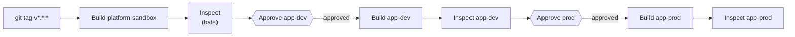

# Verification and CI/CD

Part of the [platform-core learning companion](README.md). Read
[Argo CD and the Handoff](argocd-and-handoff.md) first — this covers how
the finished work actually gets checked and promoted.

---

## An inspector who doesn't take the crew's word for it

`pulumi up` reporting success only means Pulumi's own steps finished
without error — it's the crew saying "we're done." It says nothing about
whether the house actually works. An independent inspector doesn't read
the crew's paperwork and nod; they walk through and check the utilities
themselves.

[`tests/integration/infrastructure.bats`](../tests/integration/infrastructure.bats)
is that inspector. It fetches the house's *real* kubeconfig from Pulumi's
own outputs, then checks — using a completely different tool than the one
that built anything — that the Docker network actually exists and
`kubectl get nodes` actually returns a working node:

```console
$ export PULUMI_STACK=platform-sandbox
$ bats tests/integration/infrastructure.bats
 ✓ docker network exists
 ✓ kubernetes cluster is accessible
```

Proof from an outside party, not the builder grading its own work.

## Smaller corrections, worth knowing without needing their own story

A few lower-stakes things this project learned the hard way, that don't
need a full incident to be useful to know:

- **`pulumi stack init <name>` does not create `Pulumi.<name>.yaml`** — a
  common assumption that turns out to be wrong. That file only appears
  after the first `pulumi config set` or `pulumi preview`/`up` against that
  stack.
- **`mypy` hangs indefinitely** on this codebase without
  `--follow-imports=skip` — it chases into `pulumi_kubernetes`'s enormous
  generated SDK otherwise. See the `lint-code` command in
  [`.circleci/config.yml`](../.circleci/config.yml).
- **`isort` and `black` disagree by default** on blank lines around
  individually-commented imports — a common formatter fight any time both
  tools are used together. Fixed once, project-wide, with
  [`.isort.cfg`](../.isort.cfg)'s `profile = black`.

## Promoting through three houses, with two checkpoints

[`.circleci/config.yml`](../.circleci/config.yml) extends the
blueprint-review-then-build idea from `platform-team-administration` across
all three houses, with a checkpoint between each promotion — because
promoting through `app-dev` before `app-prod` is the entire reason three
environments exist instead of one:



Every build step is followed immediately by its own independent inspection
before the *next* approval checkpoint even becomes available — a house is
never promoted on the builder's word alone, and a problem caught in
`app-dev` never even reaches the door of `app-prod`.

---

## Where this leads next

This repo's last act, per house, is pairing one smart-home hub to
`platform-gitops`. Every instruction that hub follows from here on lives in
that repo instead — not another `pulumi up`. `platform-gitops`'s own
learning companion picks up exactly there: what the hub actually finds when
it goes looking.
